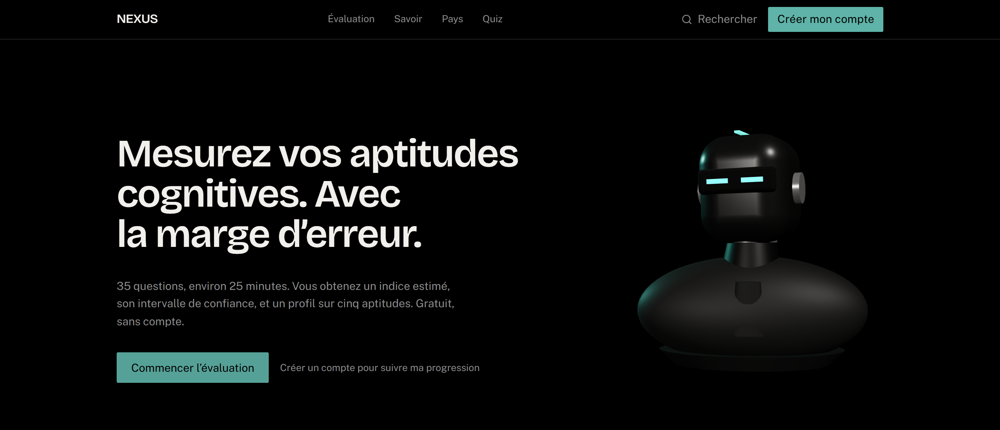
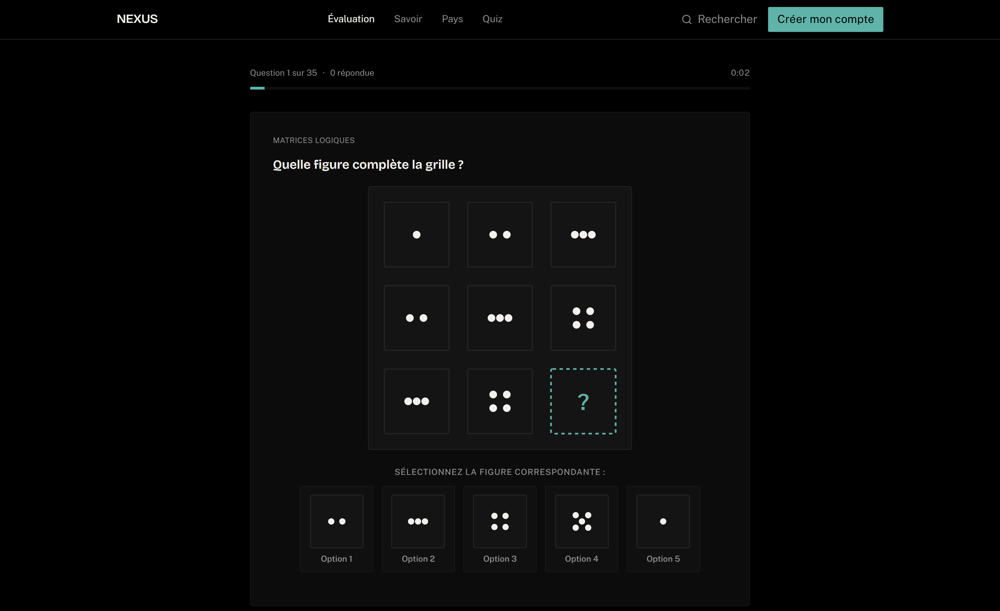
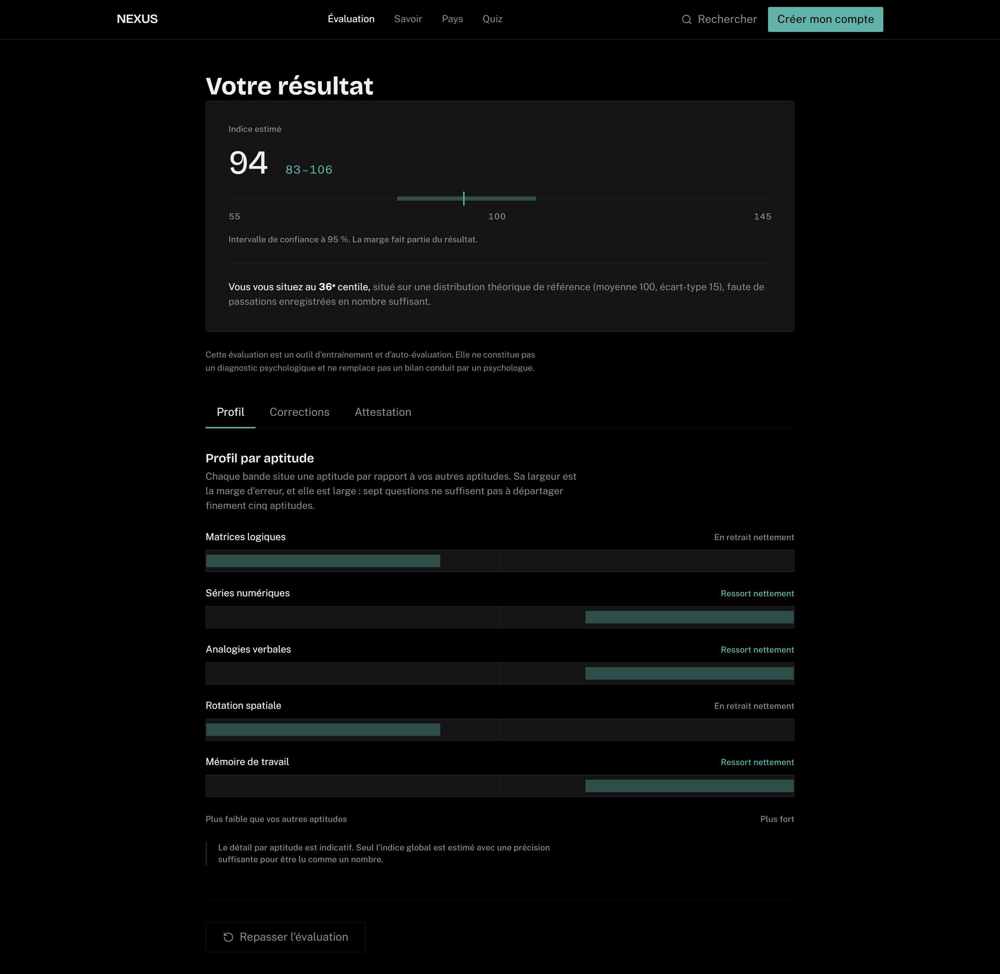

# NEXUS

Plateforme web d'évaluation des aptitudes cognitives. Une passation de 35 questions
produit un indice estimé, son intervalle de confiance à 95 %, un profil sur cinq
aptitudes et un centile dont la population de référence est nommée.

Le parti pris du produit est la mesure honnête : lorsque les réponses ne se distinguent
pas statistiquement d'un tirage au hasard, aucun score n'est affiché.

**Site en ligne : [taupe-lily-ac2081.netlify.app](https://taupe-lily-ac2081.netlify.app)**



---

## Fonctionnalités

### Moteur d'évaluation psychométrique

Le cœur du produit. L'estimation repose sur un modèle de réponse à l'item à trois
paramètres (IRT 3PL), et non sur un total de bonnes réponses.

- **Modèle 3PL** : discrimination, difficulté et pseudo-hasard par item, avec la
  constante de mise à l'échelle logistique D = 1,702.
- **Estimation de l'aptitude par EAP** sur une grille de quadrature (−4 à +4, pas de
  0,05) avec loi a priori normale centrée réduite ; l'erreur type est dérivée de la
  loi a posteriori.
- **Mise à l'échelle** vers une moyenne de 100 et un écart type de 15, avec intervalle
  de confiance à 95 % calculé depuis l'erreur type.
- **Banque de 120 items** répartis sur cinq aptitudes : matrices logiques, séries
  numériques, analogies verbales, rotation spatiale, mémoire de travail.
- **Sélection adaptative de session** : 30, 35 ou 40 items tirés de façon équilibrée
  par aptitude et par niveau de difficulté, avec contrôle d'exposition limitant le
  recouvrement entre deux passations successives.
- **Contrôle de validité** : test binomial unilatéral contre le hasard, détection des
  réponses expédiées par comparaison au temps de résolution attendu de chaque item, et
  trois verdicts distincts — exploitable, précision faible, non interprétable.
- **Recalibrage** : statistiques par item (corrélation point-bisériale convertie en
  discrimination, difficulté empirique via la fonction probit) et normalisation
  empirique dès que la population de référence est suffisante.



### Restitution du résultat

- Indice estimé présenté avec son intervalle de confiance, la barre d'intervalle étant
  l'élément visuel principal plutôt que le chiffre seul.
- Profil par aptitude en bandes relatives, positionné par écart à la moyenne du
  répondant lui-même, la largeur de bande reflétant l'incertitude de mesure.
- Centile accompagné de la description explicite de sa population de référence.
- Corrections détaillées item par item, avec le raisonnement attendu.
- Attestation nominative téléchargeable.



### Comptes et espace personnel

- Inscription, connexion, réinitialisation de mot de passe.
- Parcours d'accueil en trois étapes pour un nouveau compte.
- Tableau de bord, profil, paramètres, historique des transactions.
- Routes protégées avec retour à la page initialement demandée après connexion.
- Persistance sur PostgreSQL via Supabase, avec politiques de sécurité au niveau des
  lignes (RLS) : l'autorisation est portée par la base, pas par le client.

### Paiement mobile money

- Déblocage unitaire des corrections détaillées et de l'attestation pour 500 XOF.
- Couche d'abstraction `PaymentProvider` avec deux implémentations : CinetPay pour le
  mobile money ivoirien, et un fournisseur local pour le développement.
- Vérification HMAC-SHA256 de la signature du webhook, avec comparaison à temps
  constant.
- Idempotence transactionnelle par verrou atomique en base : un webhook rejoué ne
  crédite jamais deux fois.
- Montant et plan déterminés côté serveur ; journal des transitions d'état en
  ajout seul.

### Bases de connaissances

- **195 pays** avec fiches détaillées et exploration filtrable.
- **465 questions de quiz** réparties sur neuf catégories (art, astronomie, géographie,
  histoire, mythologie, philosophie, religion, science, technologie).
- **Base de savoir** de neuf catégories et 48 sections, avec lecture d'articles.
- **Recherche transverse** accessible au clavier par `Ctrl/⌘ + K`.

### Interface

- Système visuel complet en jetons de thème Tailwind : palette de six couleurs aux
  contrastes calculés, échelle typographique, rayons, élévations et courbes de
  mouvement. Aucune valeur de couleur codée en dur dans les composants, un script de
  contrôle le vérifiant à chaque `lint`.
- Typographie Bricolage Grotesque pour les titres, Public Sans pour le texte courant,
  toutes deux auto-hébergées.
- **Robot 3D interactif** dans le hero : géométrie procédurale animée par ressort
  amorti, le regard suivant le curseur avec inertie, le buste suivant à 30 % de l'angle
  de la tête, respiration et clignement irrégulier, retour à la pose neutre après
  inactivité.
- Accessibilité : lien d'évitement, focus visible partout, cibles tactiles d'au moins
  44 px, états vides et états d'erreur conçus, respect de `prefers-reduced-motion`.

---

## Stack technique

| Domaine | Technologies |
|---|---|
| Interface | React 19, TypeScript 5.9 en mode `strict` |
| Build | Vite 7, découpage de bundle et imports dynamiques par route |
| Styles | Tailwind CSS 4 (configuration CSS-first via `@theme`) |
| Routage | React Router 7 |
| 3D | three.js, React Three Fiber, drei, maath |
| Backend | Supabase — PostgreSQL, Auth, RLS, Edge Functions (Deno) |
| Paiement | CinetPay (mobile money), vérification HMAC-SHA256 |
| Tests | Vitest — 71 tests unitaires |
| Qualité | ESLint 10, contrôle de jetons de design, audits Lighthouse et Puppeteer |
| Déploiement | Netlify |

---

## Démarrage en local

Prérequis : Node.js 20.19 ou plus récent (ou 22.12 et au-delà), et npm.

```bash
git clone https://github.com/AyyceGoat/nexus-evaluation-cognitive.git
cd nexus-evaluation-cognitive
npm install
npm run dev
```

L'application est servie sur `http://localhost:5173`.

### Configuration

Copier le modèle de variables d'environnement et le renseigner :

```bash
cp .env.example .env
```

| Variable | Portée | Rôle |
|---|---|---|
| `VITE_SUPABASE_URL` | navigateur | URL du projet Supabase |
| `VITE_SUPABASE_ANON_KEY` | navigateur | Clé publiable ; ce sont les politiques RLS qui protègent les données |
| `SUPABASE_SERVICE_ROLE_KEY` | serveur | Réservée aux Edge Functions |
| `CINETPAY_API_KEY` | serveur | Compte marchand |
| `CINETPAY_SITE_ID` | serveur | Compte marchand |
| `CINETPAY_SECRET_KEY` | serveur | Vérification de la signature du webhook |
| `PAYMENT_PROVIDER` | serveur | Fournisseur de paiement actif |
| `PUBLIC_SITE_URL` | serveur | Construction des URL de retour de paiement |

Aucune valeur préfixée `VITE_` n'est secrète : le préfixe inclut la variable dans le
bundle envoyé au navigateur. Le fichier `.env` est ignoré par Git.

### Commandes

| Commande | Effet |
|---|---|
| `npm run dev` | Serveur de développement |
| `npm run build` | Vérification des types puis compilation de production |
| `npm run preview` | Sert le site compilé |
| `npm run test` | Tests unitaires |
| `npm run typecheck` | Vérification des types seule |
| `npm run lint` | ESLint et contrôle des jetons de design |
| `npm run verifie` | Enchaîne types, lint, tests et build |
| `npm run verifie:contraste` | Calcul des ratios de contraste de la palette |
| `npm run verifie:rendu` | Rendu réel : débordements de 320 à 2560 px, cibles tactiles, focus |
| `npm run verifie:lighthouse` | Audit Lighthouse sur les pages principales |
| `npm run verifie:parcours` | Parcours de bout en bout dans un navigateur |

---

## Structure du projet

```
src/
├── app/                 Routage, contexte d'authentification, utilitaires asynchrones
├── components/
│   ├── iq/              Écrans d'évaluation, restitution, rendu SVG des matrices
│   ├── robot/           Scène 3D, géométrie procédurale, ressort, suivi du curseur
│   ├── search/          Recherche transverse
│   └── ui/              Boutons, champs, dialogues, états de chargement et d'erreur
├── data/
│   ├── iq/              Banque de 120 items, répartie par aptitude
│   ├── countries.ts     195 pays
│   ├── knowledge.ts     Base de savoir
│   └── quiz.ts          465 questions
├── lib/
│   ├── backend/         Port d'accès aux données, implémentations Supabase et locale
│   ├── iq/              Modèle IRT, échelle, validité, sélection, calibrage, score
│   └── paiement/        Abstraction fournisseur, CinetPay, magasin de transactions
├── pages/               Écrans publics, authentification, espace connecté
└── index.css            Jetons de thème : couleurs, typographie, rayons, mouvement

supabase/
├── migrations/          Schéma PostgreSQL et politiques RLS
└── functions/           Edge Functions : création de paiement, webhook

scripts/                 Outils de vérification : contraste, jetons, rendu, Lighthouse
docs/                    Documentation technique et captures d'écran
```

---

## Qualité

Mesures relevées sur le site compilé, dans un navigateur réel, en profil mobile avec
bridage réseau.

| Indicateur | Résultat |
|---|---|
| Lighthouse — performance | 97 à 99 sur les cinq pages principales |
| Lighthouse — accessibilité | 100 |
| Lighthouse — bonnes pratiques | 100 |
| Lighthouse — SEO | 100 |
| Décalage cumulé de mise en page | 0,000 |
| Plus grand rendu de contenu | 1,96 à 2,48 s |
| Chunk d'entrée | 91 ko compressés, `three` exclu du chargement initial |
| Débordement horizontal | aucun, de 320 à 2560 px |
| Cible tactile sous 44 px | aucune |
| Tests unitaires | 71 |
